# MyType Backend 모듈 의존구조

## 전체 모듈 의존도 차트

```mermaid
graph TD
    %% 메인 앱 모듈
    AppModule[AppModule] --> ConfigModule[ConfigModule]
    AppModule --> ThrottlerModule[ThrottlerModule]
    AppModule --> AuthModule[AuthModule]
    AppModule --> UsersModule[UsersModule]
    AppModule --> TeamsModule[TeamsModule]
    AppModule --> AppliesModule[AppliesModule]
    AppModule --> AdminModule[AdminModule]
    AppModule --> AnalysisModule[AnalysisModule]
    AppModule --> InfrastructureModule[InfrastructureModule]
    AppModule --> HealthModule[HealthModule]
    AppModule --> StacksModule[StacksModule]
    AppModule --> PositionsModule[PositionsModule]
    AppModule --> BumpsModule[BumpsModule]
    AppModule --> FilesModule[FilesModule]
    AppModule --> ImagesModule[ImagesModule]
    AppModule --> WebsocketModule[WebsocketModule]

    %% 인프라 모듈 의존관계
    InfrastructureModule --> PostgresModule[PostgresModule]
    InfrastructureModule --> MongoModule[MongoModule]
    InfrastructureModule --> RedisModule[RedisModule]
    InfrastructureModule --> LoggerModule[LoggerModule]
    InfrastructureModule --> SchedulerModule
    InfrastructureModule --> FilesModule

    %% API 모듈 간 의존관계
    AuthModule --> UsersModule
    AuthModule --> JwtModule[JwtModule]
    AuthModule --> ConfigModule

    UsersModule --> ImagesModule
    UsersModule --> S3Module[S3Module]

    TeamsModule --> UsersModule
    TeamsModule --> AuthModule
    TeamsModule --> ImagesModule
    TeamsModule --> S3Module

    %% 인프라 서비스 의존관계
    RedisModule --> ConfigModule
    FilesModule --> S3Module
    SchedulerModule --> PostgresModule

    %% 스타일링
    classDef appModule fill:#e1f5fe
    classDef apiModule fill:#f3e5f5
    classDef infraModule fill:#e8f5e8
    classDef configModule fill:#fff3e0

    class AppModule appModule
    class AuthModule,UsersModule,TeamsModule,AppliesModule,AdminModule,AnalysisModule,HealthModule,StacksModule,PositionsModule,BumpsModule,ImagesModule apiModule
    class InfrastructureModule,PostgresModule,MongoModule,RedisModule,LoggerModule,SchedulerModule,FilesModule,S3Module infraModule
    class ConfigModule,ThrottlerModule,JwtModule configModule
```

## 계층별 구조

```mermaid
graph TD
    subgraph "Presentation Layer"
        WebsocketModule
    end

    subgraph "API Layer"
        AuthModule
        UsersModule
        TeamsModule
        AppliesModule
        AdminModule
        AnalysisModule
        HealthModule
        StacksModule
        PositionsModule
        BumpsModule
        ImagesModule
    end

    subgraph "Infrastructure Layer"
        InfrastructureModule
        PostgresModule
        MongoModule
        RedisModule
        LoggerModule
        SchedulerModule
        FilesModule
        S3Module
    end

    subgraph "Configuration Layer"
        ConfigModule
        ThrottlerModule
        JwtModule
    end

    %% 의존관계
    WebsocketModule --> InfrastructureModule
    AuthModule --> UsersModule
    AuthModule --> ConfigModule
    UsersModule --> ImagesModule
    UsersModule --> S3Module
    TeamsModule --> UsersModule
    TeamsModule --> AuthModule
    TeamsModule --> ImagesModule
    TeamsModule --> S3Module
    InfrastructureModule --> PostgresModule
    InfrastructureModule --> MongoModule
    InfrastructureModule --> RedisModule
    InfrastructureModule --> LoggerModule
    InfrastructureModule --> SchedulerModule
    InfrastructureModule --> FilesModule
    RedisModule --> ConfigModule
    FilesModule --> S3Module

    %% 스타일링
    classDef presentation fill:#e3f2fd
    classDef api fill:#f3e5f5
    classDef infra fill:#e8f5e8
    classDef config fill:#fff3e0

    class WebsocketModule presentation
    class AuthModule,UsersModule,TeamsModule,AppliesModule,AdminModule,AnalysisModule,HealthModule,StacksModule,PositionsModule,BumpsModule,ImagesModule api
    class InfrastructureModule,PostgresModule,MongoModule,RedisModule,LoggerModule,SchedulerModule,FilesModule,S3Module infra
    class ConfigModule,ThrottlerModule,JwtModule config
```

## 주요 의존관계 설명

### 1. 인증 및 사용자 관리

- `AuthModule`은 `UsersModule`에 의존하여 사용자 정보를 관리
- JWT 토큰 기반 인증 시스템 사용
- 소셜 로그인 (카카오) 지원

### 2. 팀 관리

- `TeamsModule`은 `UsersModule`, `AuthModule`, `ImagesModule`에 의존
- 팀 생성/관리 시 사용자 인증 및 이미지 업로드 기능 활용

### 3. 인프라 서비스

- `InfrastructureModule`이 모든 인프라 서비스를 통합 관리
- PostgreSQL, MongoDB, Redis, 로깅, 스케줄러, 파일 스토리지 제공
- 전역 모듈로 설정되어 모든 API에서 접근 가능

### 4. 설정 관리

- `ConfigModule`이 전역 설정을 관리
- 환경 변수를 통한 설정 주입
- JWT, Redis, 데이터베이스 등 각종 서비스 설정 제공
